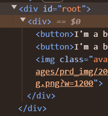
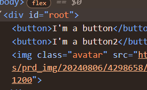

리모트에서 작업한 내용ㅁㄴㅇㄹ

로컬에서 잘못된 pull 후 머지 커밋후, 후속작업

# 복습한 내용 :

컴포넌트 선언 (es6, commonJs)

jsx가 리턴하는 컴포넌트가 2개 이상일 때는 하나의 컴포넌트로 묶어줘야한다.
(React 컴포넌트에서 여러 자식을 반환할 때, 하나의 부모 요소로 감싸야 하는 제약이 있습니다. 프레그먼트를 사용하면 이 제약을 해결할 수 있습니다.)
이럴 때 프레그먼트<> </>를 쓰면 되며, 불필요한 래퍼 노드 없이 여러 자식을 반환할 수 잇다.
아래는 div를 쓸때랑 프래그먼트를 쓸 때의 차이를 나타내는 사진이다



리액트에서 타입스크립트를 쓰는 법
인터페이스로 타입 및 Props에 대해 자료형 정의
컴포넌트 Prop 대한 타입정의

# React + TypeScript + Vite

This template provides a minimal setup to get React working in Vite with HMR and some ESLint rules.

Currently, two official plugins are available:

- [@vitejs/plugin-react](https://github.com/vitejs/vite-plugin-react/blob/main/packages/plugin-react/README.md) uses [Babel](https://babeljs.io/) for Fast Refresh
- [@vitejs/plugin-react-swc](https://github.com/vitejs/vite-plugin-react-swc) uses [SWC](https://swc.rs/) for Fast Refresh

## Expanding the ESLint configuration

If you are developing a production application, we recommend updating the configuration to enable type aware lint rules:

- Configure the top-level `parserOptions` property like this:

```js
export default tseslint.config({
  languageOptions: {
    // other options...
    parserOptions: {
      project: ['./tsconfig.node.json', './tsconfig.app.json'],
      tsconfigRootDir: import.meta.dirname,
    },
  },
});
```

- Replace `tseslint.configs.recommended` to `tseslint.configs.recommendedTypeChecked` or `tseslint.configs.strictTypeChecked`
- Optionally add `...tseslint.configs.stylisticTypeChecked`
- Install [eslint-plugin-react](https://github.com/jsx-eslint/eslint-plugin-react) and update the config:

```js
// eslint.config.js
import react from 'eslint-plugin-react';

export default tseslint.config({
  // Set the react version
  settings: { react: { version: '18.3' } },
  plugins: {
    // Add the react plugin
    react,
  },
  rules: {
    // other rules...
    // Enable its recommended rules
    ...react.configs.recommended.rules,
    ...react.configs['jsx-runtime'].rules,
  },
});
```
